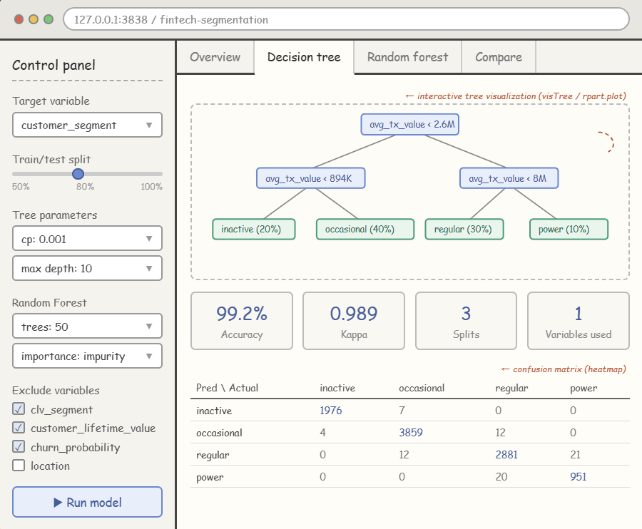

# 1. Load Packages and Data

```{r}
pacman::p_load(tidyverse, rpart, rpart.plot, visNetwork, 
               ranger, patchwork, corrplot, caret)
```

```{r}
df <- read_csv("data/customer_data.csv")
glimpse(df)
```

# 2. Data Preparation

## 2.1 Variable Selection Rationale

Before building our model, we need to carefully examine all 54 variables and decide which to keep. The following variables are ones I will remove:

1.  ID and Date: 'customer_id' is just a number, and 'date' is a raw string; these are meaningless for prediction.
2.  Free Text: 'feature_requests' and 'complaint_topics'have too many missing values and are textual data, useless for decision trees.
3.  Data Leakage: 'clv_segment' and 'customer_lifetime_value' are strongly correlated with the target variable 'customer_segment', causing the model to access the target variable.

### Variables Removed

| Variable(s) | Reason |
|----|----|
| `customer_id` | Row identifier, no predictive value |
| `first_tx`, `last_tx`, `first_transaction_date`, `last_transaction_date`, `last_survey_date` | Raw date strings; temporal information already captured by `customer_tenure` |
| `feature_requests` | Free-text field with 33% missing values |
| `complaint_topics` | Free-text field with 50% missing values |
| `clv_segment` | **Data leakage** — strongly correlated with `customer_segment` (e.g., 74% of *power* users are Platinum, 64% of *inactive* are Bronze) |
| `customer_lifetime_value` | **Data leakage** — mean CLV differs by 15× between *power* and *inactive* segments; likely derived from the same underlying data |
| `churn_probability` | Near-constant across all segments (mean ≈ 0.343 for every group), contributes no discriminative power |

```{r}
df_analysis <- df %>%
  select(-customer_id,
         -first_tx, -last_tx,
         -first_transaction_date, -last_transaction_date,
         -last_survey_date,
         -feature_requests, -complaint_topics,
         -clv_segment,
         -customer_lifetime_value,
         -churn_probability)
```

## 2.2 Handling Missing Values

Decision trees in R require categorical predictors to be factors. We convert all character and logical columns accordingly. The target variable 'customer_segment' is also converted to a factor with a meaningful level order.

```{r}
colSums(is.na(df_analysis)) %>% 
  .[. > 0] %>% 
  sort(decreasing = TRUE)
```

'credit_utilization_ratio' has 18,000 missing values. This is because customers without a credit card would not have a utilization ratio. We impute these with 0, representing no credit usage.

```{r}
df_analysis <- df_analysis %>%
  mutate(credit_utilization_ratio = replace_na(credit_utilization_ratio, 0))

sum(is.na(df_analysis))
```

## 2.3 Dummy Encoding of Categorical Variables

The `rpart` algorithm evaluates all possible subsets of factor levels at each split, which becomes computationally expensive when a categorical variable has many levels. To ensure efficient model training, we convert all categorical variables into dummy variables while preserving the target variable `customer_segment` as a factor.

```{r}
# Separate target variable
target <- factor(df_analysis$customer_segment, 
                 levels = c("inactive", "occasional", "regular", "power"))

# Create dummy variables for all predictors
predictors <- df_analysis %>% select(-customer_segment)

# Convert logical to numeric (TRUE/FALSE -> 1/0)
predictors <- predictors %>%
  mutate(across(where(is.logical), as.integer))

# One-hot encode character variables
dummy_formula <- dummyVars(~ ., data = predictors)
predictors_encoded <- predict(dummy_formula, newdata = predictors) %>% 
  as.data.frame()
names(predictors_encoded) <- make.names(names(predictors_encoded), unique = TRUE)
# Combine back with target
df_model <- predictors_encoded %>%
  mutate(customer_segment = target)

cat("Final dataset:", nrow(df_model), "rows x", ncol(df_model), "columns\n")
```

## 2.4 Exploratory Overview of Target Variable

```{r}
#| fig-width: 8
#| fig-height: 4
ggplot(df_model, aes(x = customer_segment, fill = customer_segment)) +
  geom_bar() +
  geom_text(stat = "count", aes(label = after_stat(count)), vjust = -0.5) +
  labs(title = "Distribution of Customer Segments",
       x = "Customer Segment", y = "Count") +
  theme_minimal() +
  theme(legend.position = "none")
```

## 2.5 Correlation Check (Numeric Variables Only)

While decision trees are robust to multicollinearity, a quick correlation heatmap of selected key numeric predictors helps us understand the variable structure.

```{r}
#| fig-width: 10
#| fig-height: 10
# Select original numeric variables (not dummies) for readability
key_vars <- df_analysis %>% 
  select(where(is.numeric)) %>%
  select(-starts_with("total_tx"), -starts_with("total_transaction"))

cor_matrix <- cor(key_vars, use = "complete.obs")

corrplot(cor_matrix, 
         method = "color", 
         type = "lower",
         tl.cex = 0.6,
         tl.col = "black",
         addCoef.col = "black",
         number.cex = 0.4,
         diag = FALSE,
         title = "Correlation Matrix of Key Numeric Predictors",
         mar = c(0, 0, 2, 0))
```

# 3. Classification Tree

## 3.1 Train-Test Split

We use an 80/20 stratified split to preserve the class distribution in both sets.

```{r}
set.seed(1234)

trainIndex <- createDataPartition(df_model$customer_segment, 
                                  p = 0.8, 
                                  list = FALSE)

df_train <- df_model[trainIndex, ]
df_test  <- df_model[-trainIndex, ]
```

Verify stratification:

```{r}
cat("Training set class proportions:\n")
round(prop.table(table(df_train$customer_segment)), 3)

cat("\nTest set class proportions:\n")
round(prop.table(table(df_test$customer_segment)), 3)
```

## 3.2 Basic Classification Tree

We use `rpart` with the `"class"` method for classification. Initial parameters are set conservatively to allow the tree to grow before pruning.

```{r}
tree_model <- rpart(customer_segment ~ ., 
                    data = df_train, 
                    method = "class",
                    control = rpart.control(minsplit = 20, 
                                            cp = 0.001, 
                                            maxdepth = 10))
```

### Visualising the Classification Tree

```{r}
#| fig-width: 14
#| fig-height: 10
rpart.plot(tree_model, 
           type = 4, 
           extra = 104,
           fallen.leaves = TRUE,
           roundint = FALSE,
           main = "Classification Tree: Customer Segment",
           cex = 0.5)
```

### Interactive Tree Visualisation

```{r}
visTree(tree_model, 
        edgesFontSize = 14, 
        nodesFontSize = 16, 
        width = "100%")
```

## 3.3 Hyperparameter Tuning via CP Table

The Complexity Parameter table helps us find the optimal tree size by identifying the CP value that minimises cross-validated error.

```{r}
printcp(tree_model)
```

```{r}
#| fig-width: 8
#| fig-height: 5
plotcp(tree_model)
```

### Pruning the Tree

```{r}
bestcp <- tree_model$cptable[which.min(tree_model$cptable[, "xerror"]), "CP"]
cat("Best CP:", bestcp, "\n")

pruned_tree <- prune(tree_model, cp = bestcp)
```

```{r}
#| fig-width: 14
#| fig-height: 10
rpart.plot(pruned_tree, 
           type = 4, 
           extra = 104,
           fallen.leaves = TRUE,
           roundint = FALSE,
           main = "Pruned Classification Tree: Customer Segment",
           cex = 0.6)
```

## 3.4 Evaluate on Test Set

```{r}
pred_tree <- predict(pruned_tree, df_test, type = "class")

cm_tree <- confusionMatrix(pred_tree, df_test$customer_segment)
print(cm_tree)
```

# 4. Random Forest

## 4.1 Training

We use the `ranger` engine directly (rather than through `caret::train()`) for computational efficiency with our large dataset of \~39,000 training observations.

```{r}
rf_model <- ranger(customer_segment ~ ., 
                   data = df_train,
                   num.trees = 50,
                   importance = "impurity",
                   seed = 1234)

print(rf_model)
```

## 4.2 Evaluate on Test Set

```{r}
pred_rf <- predict(rf_model, df_test)$predictions

cm_rf <- confusionMatrix(pred_rf, df_test$customer_segment)
print(cm_rf)
```

## 4.3 Variable Importance (Top 20)

The variable importance plot confirms ‘avg_tx_value’ as the most dominant predictor which importance is 15000, followed by `total_tx_volume` and `tx_count` . These top three variables are all directly related to transaction monetary value and volume. Satisfaction metrics `tx_satisfaction` and `base_satisfaction` appear in positions 4–5, but with importance values roughly 5–6× lower than the top predictor. Demographic variables , product adoption , and app engagement such as `app_logins_frequency`, `feature_usage_diversity` contribute minimally, suggesting they play almost no role in determining customer segment membership.

```{r}
#| fig-width: 10
#| fig-height: 7
imp_df <- data.frame(
  Variable = names(rf_model$variable.importance),
  Importance = rf_model$variable.importance
) %>% 
  arrange(desc(Importance)) %>%
  head(20)

ggplot(imp_df, aes(x = reorder(Variable, Importance), y = Importance)) +
  geom_col(fill = "steelblue") +
  coord_flip() +
  labs(title = "Random Forest: Top 20 Variable Importance",
       x = NULL, y = "Importance") +
  theme_minimal()
```

## 4.4 Model Comparison

```{r}
comparison <- data.frame(
  Model = c("Pruned Classification Tree", "Random Forest"),
  Accuracy = c(cm_tree$overall["Accuracy"], 
               cm_rf$overall["Accuracy"]),
  Kappa = c(cm_tree$overall["Kappa"], 
            cm_rf$overall["Kappa"])
)

knitr::kable(comparison, digits = 4, 
             caption = "Model Performance Comparison on Test Set")
```

```{r}
#| fig-width: 10
#| fig-height: 5
p1 <- as.data.frame(cm_tree$table) %>%
  ggplot(aes(x = Reference, y = Prediction, fill = Freq)) +
  geom_tile() +
  geom_text(aes(label = Freq), size = 3.5) +
  scale_fill_gradient(low = "white", high = "steelblue") +
  labs(title = "Pruned Tree") +
  theme_minimal() +
  theme(axis.text.x = element_text(angle = 45, hjust = 1))

p2 <- as.data.frame(cm_rf$table) %>%
  ggplot(aes(x = Reference, y = Prediction, fill = Freq)) +
  geom_tile() +
  geom_text(aes(label = Freq), size = 3.5) +
  scale_fill_gradient(low = "white", high = "steelblue") +
  labs(title = "Random Forest") +
  theme_minimal() +
  theme(axis.text.x = element_text(angle = 45, hjust = 1))

p1 + p2 + 
  plot_annotation(title = "Confusion Matrix Comparison",
                  theme = theme(plot.title = element_text(size = 16)))
```

# 5. Proposed Shiny Application Design



The proposed Shiny application features a sidebar control panel allowing users to interactively adjust model parameters (complexity parameter, max depth, number of trees) and variable selection. The main panel is organised into four tabs: Overview：for exploratory data analysis Decision Tree： for the classification tree visualisation and evaluation Random Forest： for ensemble model results Compare：for side-by-side model performance comparison.
